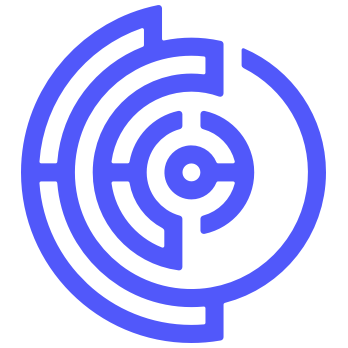

<h1 align="center">Effect Network</h1>

The Future-of-Work

Join us in creating the decentralized network for human intelligence! Effect is
focused on creating a distributed workforce where workers and requesters can
easily connect with each other. Where the interactions are managed by smart
contracts and policies are instituted by the community. Be part of building the
Future-of-Work.

## 🤷🏽‍♀️ Why?

We believe in the ability of communities to self-govern. At Effect, the
community decides on fair and just policies that are implemented on the
blockchain and define the relationship between workers and requesters. Effect
Network is a place where people can work from anywhere at any time without fear
of being exploited. There is still much work to be done. Help us build the tools
and infrastructure that will propel the digital working class forward.

## 🕵 How?

How can you help us build? There are various things you can do to help,
depending on your skill set. The best way to get started is to reach out and
join our [Discord community](https://discord.gg/effectnetwork). You can also join
[our DAO](https://dao.effect.network) and be rewarded for your
contributions. Examine the [DAO Proposal
Tracker](https://effect-dao-docs.gitbook.io/proposal-tracker/) to see if you can
contribute to any existing proposals or start a new one.

- 👩🏻‍💻 **Developer**- If you are a developer and want to contribute to a
  project, please read our style and [contribution
  guides](.github/CONTRIBUTING.md). Look
  through the Github issue boards and feel free to start a Pull Request. Developer documentation can be found at: [developer.effect.network](https://developer.effect.network)

- 👨🏻‍🚒 **Community Management**- We need more people to help guide newer
  members as the community grows. You can help by assisting on the Discord
  server or by participating in the DAO and platform governance at
  [https://dao.effect.network](https://dao.effect.network).

- 👩🏻‍🍳 **Documentation / Guides**- In addition to our official documentation
  for developers, we have community-maintained documentation. They can be found
  here: [docs](https://effect-dao-docs.gitbook.io/dao-guides/)

- 👩🏿‍🏭 **Testers**- Here be dragons, and we need to make sure that they can't
  harm us. Help us find bugs and report them when you find them! The workforce
  platform is under active development and can be found at
  [worker.effect.ai](https://worker.effect.ai).

- 👩🏾‍🚀 **Marketing**- Tell it on the mountain, over the hills, and everywhere!
  We are always looking for content writers and marketers to help us spread the
  word and grow.

## Join the Force

By joining Effect Force, you will be able to begin earning tokens by performing
quick digital tasks. Get started at
[worker.effect.ai](https://worker.effect.ai).

## Become a Requester

The Effect Force SDK and Builder interface are still in development. If you are
already looking for data annotations by our talented workforce, please [reach
out to us here](https://form.typeform.com/to/XpQoFq).

## Code of Conduct

You can take a look at our code of conduct here: [CODE OF
CONDUCT](.github/CODE_OF_CONDUCT.md)
