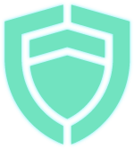
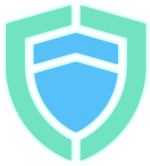
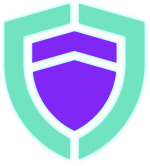

# Membership
{: .no_toc}

## Table of contents
{: .no_toc .text-delta }

1. TOC
{:toc}

---

## Becoming a DAO member

The first step to participating in the EffectDAO is to become a member. This can
be done by signing the constitution on [the DAO
page](https://dashboard.effect.ai/dao) of the Effect Dashboard. As a member you
are able to participate in the governance of the project, including the option
to post proposals and receive funding.

### The constitution

The constitution is an essential document that binds all members of the
DAO. Once the constitution is signed your signature is stored on the blockchain
and you have become a member. The current active version can be [found
here](https://github.com/effectai/effect-network-eos/blob/156f0f78cbce9f8f36fb8707285056cc800e25d3/constitution/constitution.md). If
the constitution is updated in a significant way it's required to re-sign it
from the dashboard.

### Ranks

After becoming a member you can acquire a rank by staking an amount of tokens. This is an overview of the ranks and requirements:

|                                                                     | Name              | Stake requirements | Privileges                           |
|:-------------------------------------------------------------------:|:------------------|:-------------------|:-------------------------------------|
|                                                                     | Member            | 500 EFX            | Submit proposals, join DAO channels   |
|  | Guardian #1       | 100k EP + 10k NFX  | Voting on proposals and resolutions  |
|  | Guardian #2       |                    |                                      |
|  | Guardian #3       |                    |                                      |
|  | Guardian #4       |                    |                                      |
|  | Guardian #5       |                    |                                      |
|  | Guardian #6       |                    |                                      |
|  | Guardian #7       |                    |                                      |
|  | Guardian #8       |                    |                                      |
|                                                                     | High Guard Member | Election only      | Special and Extraordinary Resolutions |

## Guardians

A Guardian is a DAO member with a significant amount of stake in the
network. They have the privilege to vote on resolutions and proposals that
determine what changes are made to the network and how funds are assigned.

As an active Guardian you play an important role in the EffectDAO. This comes
with the advantage of receiving rewards in the form of network fees. The
specifics on how the rewards are accumulated and distributed will be discussed
in a future chapter.

There is no explicit cap on the number of Guardians, but if we estimate that the
total supply of NFX to never exceed 10,000,000 then there can never be more than
a 1,000 Guardians.

### Commitments

Once the EffectDAO Phase 0 is fully launched it is important for Guardians to
stay in tune with the voting cycles and changes in the regulations. It's highly
recommended to keep an eye on the Discord server.

## High Guard

The High Guard is an elected group of a minimum of 7 Guardians that hold the
highest office in the DAO. Together they have the final say on all important
matters. In Phase 0 the High Guard Members are also tasked with approving every
proposal that is voted in by the Guardians and have the ability to execute
Special Resolutions to make adjustments to the DAO. This is a security measure
to ensure that the DAO can't be manipulated by malicious sources in its early
stages.
